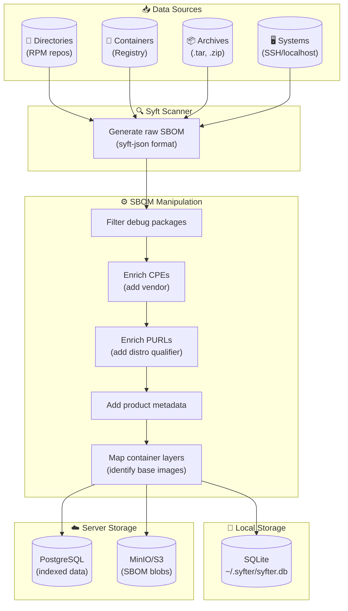
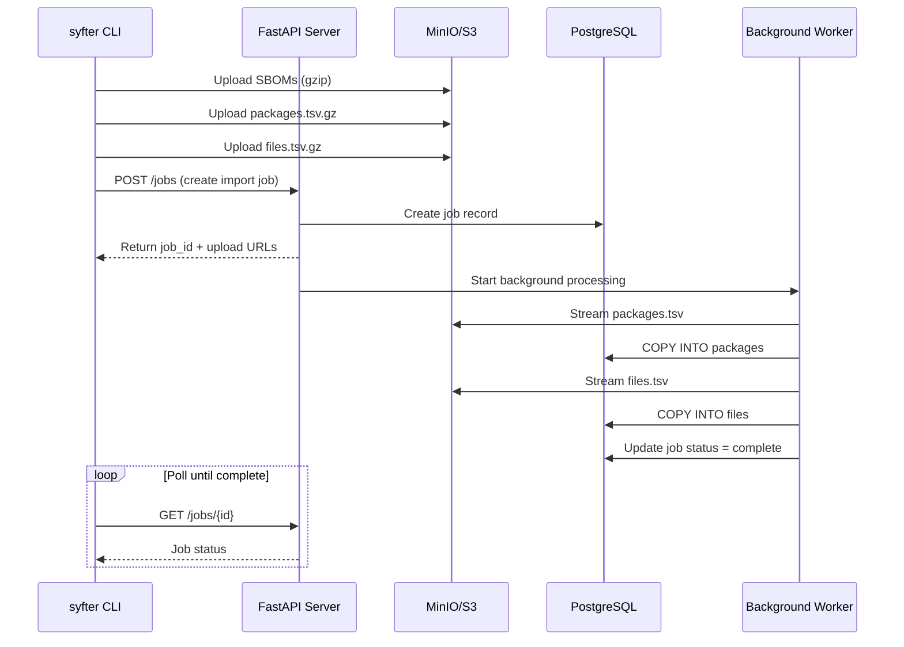
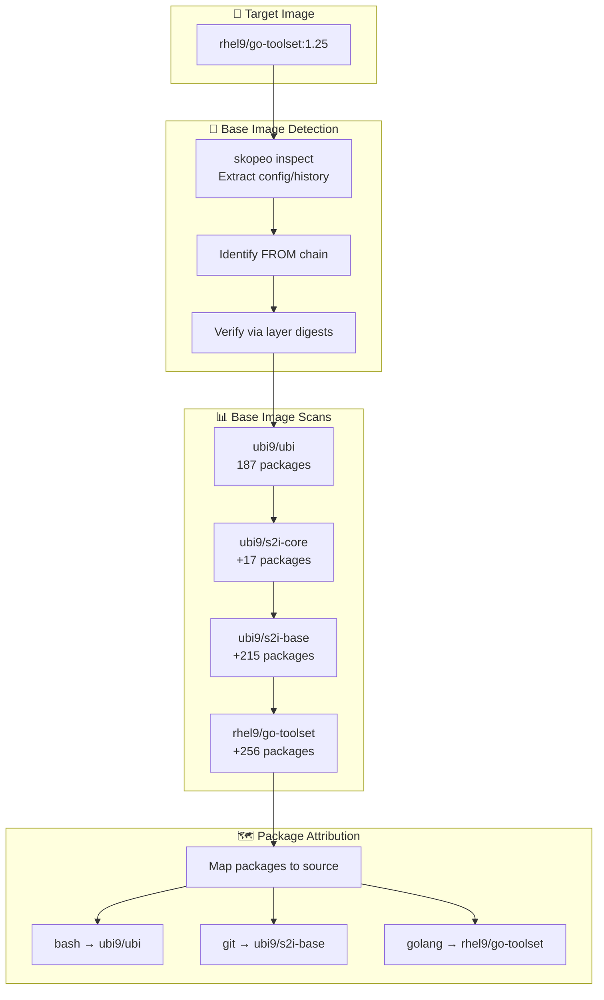

# Syfter Data Flow

This document describes how data flows through the Syfter system, from input sources through processing to storage.

## High-Level Overview (Mermaid)



## High-Level Overview (ASCII)

```
┌─────────────────────────────────────────────────────────────────────────────────────┐
│                                  DATA SOURCES                                        │
│  ┌───────────────┐  ┌───────────────┐  ┌───────────────┐  ┌───────────────────────┐ │
│  │  Directories  │  │  Containers   │  │   Archives    │  │   Systems (SSH)       │ │
│  │  (RPM repos)  │  │  (Registry)   │  │  (.tar, .zip) │  │  (localhost/remote)   │ │
│  └───────┬───────┘  └───────┬───────┘  └───────┬───────┘  └───────────┬───────────┘ │
└──────────┼──────────────────┼──────────────────┼──────────────────────┼─────────────┘
           │                  │                  │                      │
           └──────────────────┴────────┬─────────┴──────────────────────┘
                                       ▼
┌─────────────────────────────────────────────────────────────────────────────────────┐
│                                 SYFT SCANNER                                         │
│                    Generates raw SBOM in syft-json format                           │
└─────────────────────────────────────────────────────────────────────────────────────┘
                                       │
                                       ▼
┌─────────────────────────────────────────────────────────────────────────────────────┐
│                              SBOM MANIPULATION                                       │
│  ┌─────────────────┐  ┌─────────────────┐  ┌─────────────────┐  ┌────────────────┐  │
│  │ Filter Debug    │  │ Enrich CPEs     │  │ Enrich PURLs    │  │ Add Product    │  │
│  │ Packages        │  │ (vendor info)   │  │ (distro qual)   │  │ Metadata       │  │
│  └─────────────────┘  └─────────────────┘  └─────────────────┘  └────────────────┘  │
│                                                                                      │
│  ┌─────────────────┐  ┌─────────────────┐                                           │
│  │ Extract Layer   │  │ Map Packages    │  (Container scans only)                   │
│  │ Information     │  │ to Base Images  │                                           │
│  └─────────────────┘  └─────────────────┘                                           │
└─────────────────────────────────────────────────────────────────────────────────────┘
                                       │
                    ┌──────────────────┴──────────────────┐
                    ▼                                      ▼
┌──────────────────────────────────┐    ┌──────────────────────────────────────────────┐
│         LOCAL STORAGE            │    │              SERVER STORAGE                   │
│                                  │    │                                               │
│  ┌────────────────────────────┐  │    │  ┌─────────────────┐  ┌─────────────────────┐│
│  │      SQLite Database       │  │    │  │   PostgreSQL    │  │    MinIO / S3       ││
│  │                            │  │    │  │                 │  │                     ││
│  │  • Products table          │  │    │  │ • Products      │  │ • Original SBOMs    ││
│  │  • Systems table           │  │    │  │ • Systems       │  │   (compressed)      ││
│  │  • Scans table + SBOM blob │  │    │  │ • Scans (meta)  │  │ • Modified SBOMs    ││
│  │  • Packages table          │  │    │  │ • Packages      │  │   (compressed)      ││
│  │  • Files table             │  │    │  │ • Files         │  │ • TSV import files  ││
│  │  • Image layers JSON       │  │    │  │ • Jobs          │  │                     ││
│  └────────────────────────────┘  │    │  │ • Image layers  │  │                     ││
│                                  │    │  └─────────────────┘  └─────────────────────┘│
│   ~/.syfter/syfter.db        │    │                                               │
└──────────────────────────────────┘    └──────────────────────────────────────────────┘
```

## Detailed Data Flow

### 1. Input Sources

Syfter can scan multiple types of data sources:

| Source Type | Description | Example |
|-------------|-------------|---------|
| **Directory** | Local filesystem path containing RPMs or other packages | `dir:/path/to/rpms` |
| **Container** | Container images from registries, local daemon, or archives | `registry.redhat.io/ubi9/ubi:latest` |
| **Archive** | Tar/zip archives containing packages | `file:product.tar.gz` |
| **Localhost** | The local system's installed packages | `syfter system-scan` |
| **Remote Host** | Remote system via SSH | `syfter system-scan webserver01` |

### 2. Syft Scanner

```
┌─────────────────────────────────────────────────────────────────┐
│                        SYFT SCANNER                             │
│                                                                 │
│   Input: Target path/image/archive                              │
│                                                                 │
│   Processing:                                                   │
│   ┌─────────────┐   ┌─────────────┐   ┌─────────────────────┐  │
│   │ Detect      │ → │ Catalog     │ → │ Generate            │  │
│   │ Source Type │   │ Packages    │   │ syft-json SBOM      │  │
│   └─────────────┘   └─────────────┘   └─────────────────────┘  │
│                                                                 │
│   Output: Raw SBOM with:                                        │
│   • Package artifacts (name, version, arch, etc.)               │
│   • File locations                                              │
│   • CPEs (Common Platform Enumeration)                          │
│   • PURLs (Package URLs)                                        │
│   • Layer information (for containers)                          │
└─────────────────────────────────────────────────────────────────┘
```

### 3. SBOM Manipulation

The raw SBOM is transformed to add product-specific metadata:

```
┌─────────────────────────────────────────────────────────────────┐
│                     SBOM MANIPULATION                           │
│                                                                 │
│   ┌───────────────────────────────────────────────────────────┐ │
│   │ 1. FILTER DEBUG PACKAGES                                  │ │
│   │    Remove *-debuginfo, *-debugsource packages             │ │
│   │    Remove debug file entries                              │ │
│   └───────────────────────────────────────────────────────────┘ │
│                              ▼                                  │
│   ┌───────────────────────────────────────────────────────────┐ │
│   │ 2. ENRICH CPEs                                            │ │
│   │    Original: cpe:2.3:a:*:bash:5.1.8:*:*:*:*:*:*:*         │ │
│   │    Modified: cpe:2.3:a:redhat:bash:5.1.8:*:*:*:*:*:*:*    │ │
│   └───────────────────────────────────────────────────────────┘ │
│                              ▼                                  │
│   ┌───────────────────────────────────────────────────────────┐ │
│   │ 3. ENRICH PURLs                                           │ │
│   │    Original: pkg:rpm/rhel/bash@5.1.8-9.el9                │ │
│   │    Modified: pkg:rpm/redhat/bash@5.1.8-9.el9?             │ │
│   │              distro=rhel-10.0                             │ │
│   └───────────────────────────────────────────────────────────┘ │
│                              ▼                                  │
│   ┌───────────────────────────────────────────────────────────┐ │
│   │ 4. ADD PRODUCT METADATA                                   │ │
│   │    Add to descriptor.configuration.syfter:             │ │
│   │    • product: "rhel-10.0"                                 │ │
│   │    • vendor: "Red Hat"                                    │ │
│   │    • cpe_prefix, purl_qualifier                           │ │
│   └───────────────────────────────────────────────────────────┘ │
│                              ▼                                  │
│   ┌───────────────────────────────────────────────────────────┐ │
│   │ 5. CONTAINER LAYER MAPPING (if applicable)                │ │
│   │    • Extract layer IDs from SBOM                          │ │
│   │    • Scan base images (ubi9, s2i-base, etc.)              │ │
│   │    • Compare layer digests to identify base image chain   │ │
│   │    • Map each package to its source image                 │ │
│   └───────────────────────────────────────────────────────────┘ │
└─────────────────────────────────────────────────────────────────┘
```

### 4. Package Extraction

After manipulation, package data is extracted for indexing:

```
┌─────────────────────────────────────────────────────────────────┐
│                    PACKAGE EXTRACTION                           │
│                                                                 │
│   From each SBOM artifact, extract:                             │
│                                                                 │
│   ┌─────────────────────────────────────────────────────────┐   │
│   │ Package Record                                          │   │
│   │ ─────────────────────────────────────────────────────── │   │
│   │ • name: "bash"                                          │   │
│   │ • version: "5.1.8"                                      │   │
│   │ • release: "9.el9"                                      │   │
│   │ • arch: "x86_64"                                        │   │
│   │ • epoch: "0"                                            │   │
│   │ • source_rpm: "bash-5.1.8-9.el9.src.rpm"                │   │
│   │ • license: "GPL-3.0-or-later"                           │   │
│   │ • purl: "pkg:rpm/redhat/bash@5.1.8-9.el9?distro=..."    │   │
│   │ • cpes: ["cpe:2.3:a:redhat:bash:5.1.8:*:*:*:*:*:*:*"]   │   │
│   │ • layer_id: "a6cca9262fdd6..." (containers only)        │   │
│   │ • layer_index: 0                                        │   │
│   │ • source_image: "ubi9/ubi" (containers only)            │   │
│   │ • files: [                                              │   │
│   │     {"path": "/usr/bin/bash", "digest": "sha256:..."}   │   │
│   │   ]                                                     │   │
│   └─────────────────────────────────────────────────────────┘   │
└─────────────────────────────────────────────────────────────────┘
```

### 5. Storage Layer

#### 5a. Local Storage (SQLite)

```
┌─────────────────────────────────────────────────────────────────┐
│                   LOCAL SQLITE STORAGE                          │
│                   ~/.syfter/syfter.db                        │
│                                                                 │
│   ┌─────────────┐     ┌─────────────┐     ┌─────────────┐       │
│   │  products   │────▶│   scans     │◀────│  systems    │       │
│   │             │     │             │     │             │       │
│   │ • id        │     │ • id        │     │ • id        │       │
│   │ • name      │     │ • product_id│     │ • hostname  │       │
│   │ • version   │     │ • system_id │     │ • ip_address│       │
│   │ • vendor    │     │ • source_*  │     │ • os_name   │       │
│   │ • cpe_*     │     │ • timestamp │     │ • os_version│       │
│   │             │     │ • sbom_blob │     │ • arch      │       │
│   │             │     │ • layers_json│    │ • tag       │       │
│   └─────────────┘     └──────┬──────┘     └─────────────┘       │
│                              │                                   │
│                              ▼                                   │
│   ┌─────────────────────────────────────────────────────────┐   │
│   │                      packages                           │   │
│   │                                                         │   │
│   │ • id, scan_id, product_id, system_id                    │   │
│   │ • name, version, release, arch, epoch                   │   │
│   │ • source_rpm, license, purl, cpes                       │   │
│   │ • layer_id, layer_index, source_image                   │   │
│   └───────────────────────────┬─────────────────────────────┘   │
│                               │                                  │
│                               ▼                                  │
│   ┌─────────────────────────────────────────────────────────┐   │
│   │                        files                            │   │
│   │                                                         │   │
│   │ • id, package_id, scan_id, product_id, system_id        │   │
│   │ • path, digest, digest_algorithm                        │   │
│   └─────────────────────────────────────────────────────────┘   │
│                                                                 │
│   Key features:                                                 │
│   • SBOMs stored as gzip-compressed blobs in scans table        │
│   • Full-text search indexes on package names and file paths    │
│   • Foreign key relationships for data integrity                │
└─────────────────────────────────────────────────────────────────┘
```

#### 5b. Server Storage (PostgreSQL + S3)

```
┌─────────────────────────────────────────────────────────────────┐
│                     SERVER STORAGE                              │
│                                                                 │
│   ┌──────────────────────┐          ┌──────────────────────┐    │
│   │      PostgreSQL      │          │      MinIO / S3      │    │
│   │                      │          │                      │    │
│   │  Same schema as      │  ◀─────▶ │  Object Storage:     │    │
│   │  SQLite but:         │  (keys)  │                      │    │
│   │                      │          │  products/           │    │
│   │  • SBOMs stored as   │          │  └─ {name}/          │    │
│   │    S3 keys, not      │          │     └─ {version}/    │    │
│   │    inline blobs      │          │        ├─ scan-{id}/ │    │
│   │                      │          │        │  ├─ orig.gz │    │
│   │  • Async import via  │          │        │  └─ mod.gz  │    │
│   │    background jobs   │          │        └─ ...        │    │
│   │                      │          │                      │    │
│   │  • COPY for fast     │          │  Import staging:     │    │
│   │    bulk inserts      │          │  jobs/               │    │
│   │                      │          │  └─ {job_id}/        │    │
│   │  • Indexes for       │          │     ├─ packages.tsv  │    │
│   │    fast queries      │          │     └─ files.tsv     │    │
│   └──────────────────────┘          └──────────────────────┘    │
│                                                                 │
│   Async Upload Flow:                                            │
│   ┌────────────────────────────────────────────────────────┐    │
│   │ 1. Client uploads SBOMs + TSV to S3                    │    │
│   │ 2. Client creates import job via API                   │    │
│   │ 3. Server processes job in background:                 │    │
│   │    • Streams TSV from S3                               │    │
│   │    • Uses COPY for bulk PostgreSQL insert              │    │
│   │    • Handles millions of files efficiently             │    │
│   │ 4. Client polls job status until complete              │    │
│   └────────────────────────────────────────────────────────┘    │
└─────────────────────────────────────────────────────────────────┘
```

### Server Upload Sequence (Mermaid)



## Query Flow

```
┌─────────────────────────────────────────────────────────────────┐
│                        QUERY FLOW                               │
│                                                                 │
│   User Query                                                    │
│   syfter query -n "bash" -p rhel -v 10.0                     │
│       │                                                         │
│       ▼                                                         │
│   ┌─────────────────────────────────────────────────────────┐   │
│   │ Query Processing                                        │   │
│   │                                                         │   │
│   │ SELECT p.name, p.version, p.source_image, pr.name       │   │
│   │ FROM packages p                                         │   │
│   │ JOIN products pr ON p.product_id = pr.id                │   │
│   │ WHERE p.name LIKE '%bash%'                              │   │
│   │   AND pr.name = 'rhel'                                  │   │
│   │   AND pr.version = '10.0'                               │   │
│   └─────────────────────────────────────────────────────────┘   │
│       │                                                         │
│       ▼                                                         │
│   ┌─────────────────────────────────────────────────────────┐   │
│   │ Results                                                 │   │
│   │                                                         │   │
│   │ Name     Version     Product      Source Image          │   │
│   │ ──────────────────────────────────────────────────────  │   │
│   │ bash     5.1.8-9     rhel-10.0    ubi9/ubi              │   │
│   └─────────────────────────────────────────────────────────┘   │
└─────────────────────────────────────────────────────────────────┘
```

## Export Flow

```
┌─────────────────────────────────────────────────────────────────┐
│                       EXPORT FLOW                               │
│                                                                 │
│   syfter export -p rhel -v 10.0 -f spdx-json                 │
│       │                                                         │
│       ▼                                                         │
│   ┌───────────────────┐                                         │
│   │ Retrieve modified │                                         │
│   │ SBOM from storage │                                         │
│   └─────────┬─────────┘                                         │
│             │                                                   │
│             ▼                                                   │
│   ┌───────────────────┐      ┌───────────────────────────────┐  │
│   │ syft-json format? │──Yes─▶│ Output directly               │  │
│   └─────────┬─────────┘      └───────────────────────────────┘  │
│             │No                                                 │
│             ▼                                                   │
│   ┌───────────────────┐      ┌───────────────────────────────┐  │
│   │ Run syft convert  │──────▶│ Output in requested format:   │  │
│   │ to target format  │      │ • spdx-json                   │  │
│   └───────────────────┘      │ • spdx-tv (tag-value)         │  │
│                              │ • cyclonedx-json              │  │
│                              │ • cyclonedx-xml               │  │
│                              └───────────────────────────────┘  │
└─────────────────────────────────────────────────────────────────┘
```

## Container Layer Tracking Flow

For container images, Syfter tracks which base image contributed each package:



```
┌─────────────────────────────────────────────────────────────────┐
│               CONTAINER LAYER TRACKING FLOW                     │
│                                                                 │
│   Target: registry.redhat.io/rhel9/go-toolset:1.25              │
│       │                                                         │
│       ▼                                                         │
│   ┌───────────────────────────────────────────────────────────┐ │
│   │ 1. SCAN TARGET IMAGE                                      │ │
│   │    Extract layer IDs from Syft output                     │ │
│   │    Layers: [sha256:a6cca..., sha256:efa69..., ...]        │ │
│   └───────────────────────────────────────────────────────────┘ │
│       │                                                         │
│       ▼                                                         │
│   ┌───────────────────────────────────────────────────────────┐ │
│   │ 2. DETECT BASE IMAGE CHAIN                                │ │
│   │    Use skopeo inspect to get image config/history         │ │
│   │    Parse "created_by" for FROM instructions               │ │
│   │    → ubi9/ubi → ubi9/s2i-core → ubi9/s2i-base → go-toolset│ │
│   └───────────────────────────────────────────────────────────┘ │
│       │                                                         │
│       ▼                                                         │
│   ┌───────────────────────────────────────────────────────────┐ │
│   │ 3. VERIFY CHAIN VIA LAYER DIGESTS                         │ │
│   │    Get diff_ids for each candidate base image             │ │
│   │    Compare layer digests to confirm parentage             │ │
│   │    Build verified chain with precise image references     │ │
│   └───────────────────────────────────────────────────────────┘ │
│       │                                                         │
│       ▼                                                         │
│   ┌───────────────────────────────────────────────────────────┐ │
│   │ 4. SCAN BASE IMAGES                                       │ │
│   │    For each image in chain, run quick Syft scan           │ │
│   │    Extract package lists: {(name, version, arch): pkg}    │ │
│   └───────────────────────────────────────────────────────────┘ │
│       │                                                         │
│       ▼                                                         │
│   ┌───────────────────────────────────────────────────────────┐ │
│   │ 5. MAP PACKAGES TO SOURCE IMAGES                          │ │
│   │    For each package in target image:                      │ │
│   │    • Find first base image that contains it               │ │
│   │    • That's the source image for the package              │ │
│   │                                                           │ │
│   │    bash      → ubi9/ubi (present in base)                 │ │
│   │    git       → ubi9/s2i-base (added in this layer)        │ │
│   │    golang    → rhel9/go-toolset (added in final layer)    │ │
│   └───────────────────────────────────────────────────────────┘ │
│       │                                                         │
│       ▼                                                         │
│   ┌───────────────────────────────────────────────────────────┐ │
│   │ 6. STORE LAYER INFO                                       │ │
│   │    • packages.source_image = "ubi9/ubi"                   │ │
│   │    • packages.layer_id = "a6cca9262fdd6..."               │ │
│   │    • scans.image_layers_json = full chain metadata        │ │
│   └───────────────────────────────────────────────────────────┘ │
└─────────────────────────────────────────────────────────────────┘
```

## Security Considerations

The data flow includes several security measures:

| Stage | Protection |
|-------|------------|
| **Input** | Subprocess timeouts prevent hung scans |
| **Decompression** | 4GB size limit prevents zip bombs |
| **Upload** | JSON validation, gzip format validation |
| **Storage** | Parameterized SQL queries prevent injection |
| **Export** | Filename sanitization in HTTP headers |
| **Temp Files** | try/finally cleanup, stale dir removal |

## Data Volumes

Typical data sizes for reference:

| Component | Size per Scan | Notes |
|-----------|---------------|-------|
| Original SBOM | 5-50 MB | Compressed gzip JSON |
| Modified SBOM | 5-50 MB | Compressed gzip JSON |
| Package Index | 500K-5M rows | Depends on product |
| File Index | 1-50M rows | Largest data volume |
| Total DB | ~50 MB/scan | PostgreSQL with indexes |
| Total Storage | ~100 MB/scan | S3/MinIO objects |
